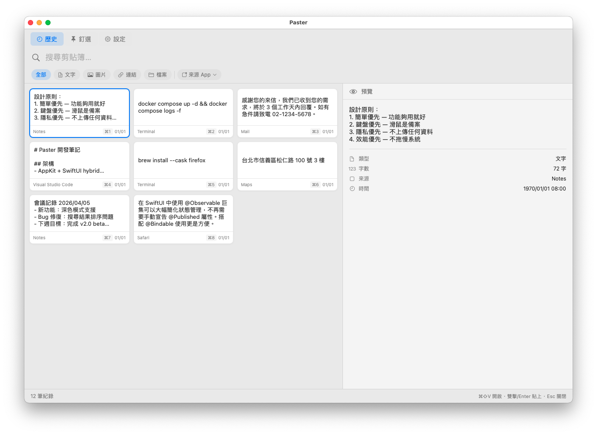
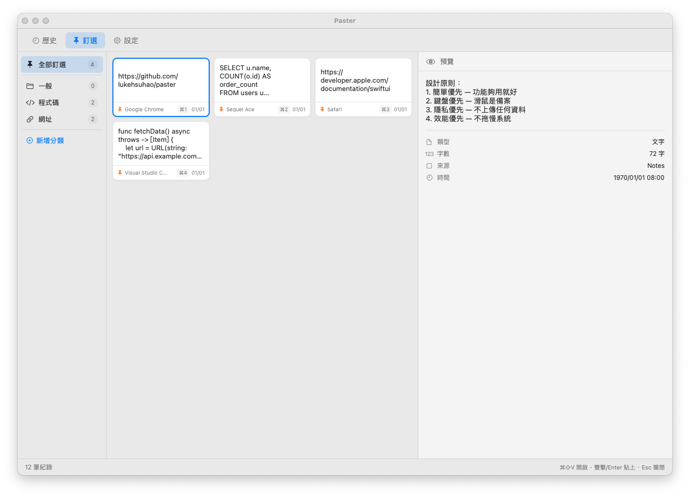
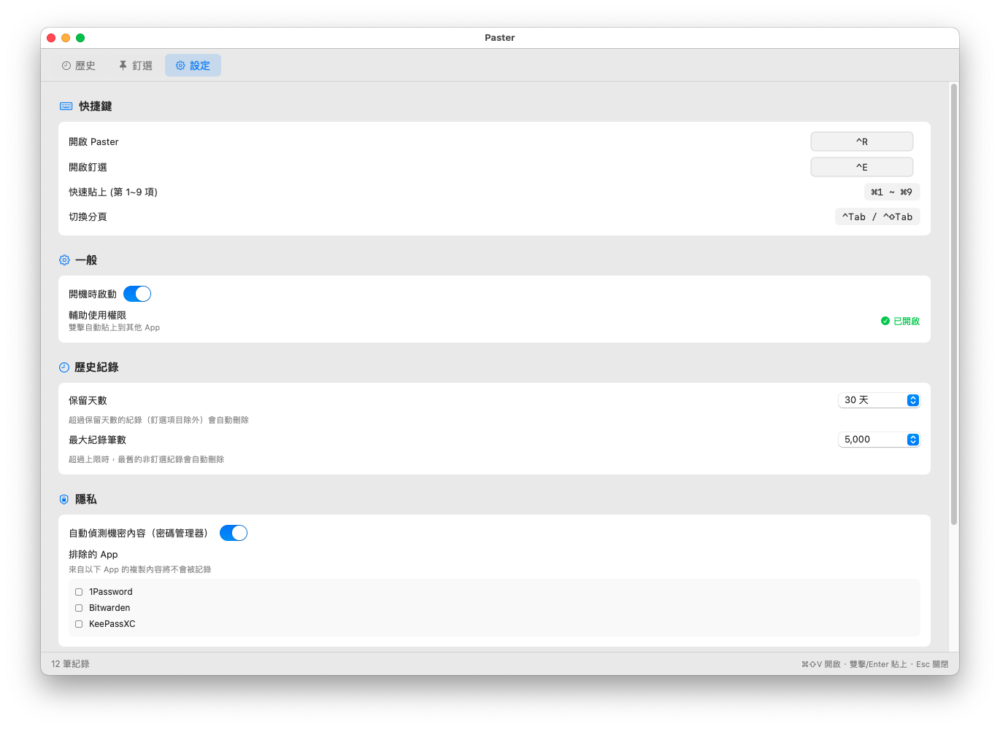

# Paster

免費、開源的 macOS 剪貼簿歷史管理工具。自動記錄複製的內容，快速搜尋、釘選常用片段、分類管理。

> 用 `Ctrl+R` 隨時叫出，選完自動貼上、自動回到原本的 App。

---

## 截圖

### 歷史紀錄 — 所有複製過的內容一覽無遺



格狀卡片瀏覽，右側即時預覽。支援依類型（文字、圖片、連結、檔案）和來源 App 篩選。

### 釘選 & 分類 — 常用片段不怕被洗掉



將常用內容釘選並分類（一般、程式碼、網址、帳號密碼等），清除歷史時釘選項目會保留。

### 設定 — 快捷鍵、隱私、自動清理



自訂快捷鍵、設定保留天數與最大筆數、自動排除密碼管理器內容。

---

## 功能特色

- **剪貼簿自動監聽** — 文字、圖片、URL、檔案路徑，複製即記錄
- **全域熱鍵** — 預設 `Ctrl+R` 呼叫主視窗（可自訂）
- **卡片式瀏覽** — 格狀卡片 + 右側預覽面板
- **即時搜尋** — 輸入即篩選，支援依類型和來源 App 篩選
- **快速貼上** — 雙擊或 Enter，自動切回前一個 App 貼上
- **釘選 & 分類** — 常用片段可釘選並分類管理
- **鍵盤操作** — `↑↓←→` 選擇、`⌘1~9` 快速貼上、`⌃Tab` 切換分頁
- **隱私保護** — 自動偵測並排除密碼管理器（1Password、Bitwarden、KeePassXC）內容
- **自動清理** — 可設定保留天數（7/30/90/365/無限）和最大筆數
- **開機自動啟動** — 一鍵開啟，不用每次手動啟動
- **自動更新** — 有新版本時自動提示下載

## 系統需求

- macOS 13 (Ventura) 以上
- Apple Silicon (arm64)

## 安裝

### 方法一：直接下載（推薦）

前往 [Releases](../../releases) 下載最新的 `Paster.dmg` 或 `Paster.app.zip`，解壓後拖到 `/Applications`。

### 方法二：從原始碼編譯

需要 macOS Command Line Tools（不需要完整 Xcode）：

```bash
git clone https://github.com/lukehsuhao/paster.git
cd paster
chmod +x build.sh
./build.sh
open Paster.app
```

## 使用方式

1. 啟動後會在選單列（Menu Bar）出現剪貼簿圖示
2. 按 `Ctrl+R`（或自訂熱鍵）開啟主視窗
3. 複製任何東西後會自動記錄
4. 雙擊或按 `Enter` 貼上到前一個 App

### 快捷鍵一覽

| 快捷鍵 | 功能 |
|--------|------|
| `Ctrl+R` | 開啟 Paster（可自訂） |
| `Ctrl+E` | 開啟釘選頁（可自訂） |
| `↑` `↓` `←` `→` | 選擇項目 |
| `Enter` | 貼上選取項目 |
| `⌘1` ~ `⌘9` | 快速貼上前 9 筆 |
| `⌃Tab` / `⌃⇧Tab` | 切換分頁 |
| `Esc` | 關閉視窗 |

### 首次使用

系統會要求授權「輔助使用」權限（用於模擬 `Cmd+V` 貼上），請到：

**系統設定 → 隱私權與安全性 → 輔助使用** → 開啟 Paster

## 授權

MIT License

## 作者

[Hao Hsu](https://github.com/lukehsuhao)
